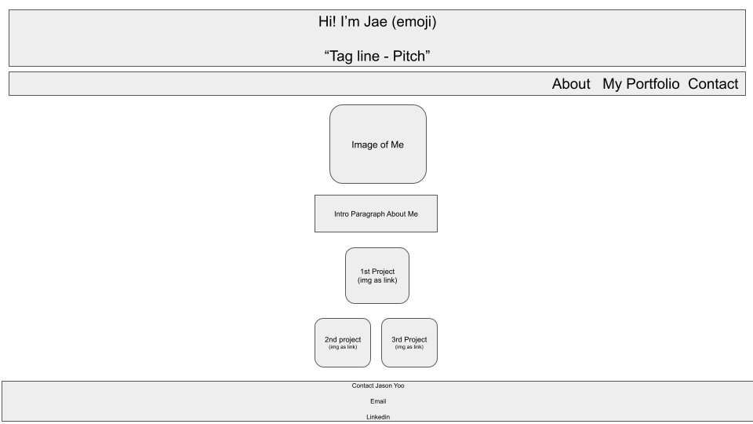
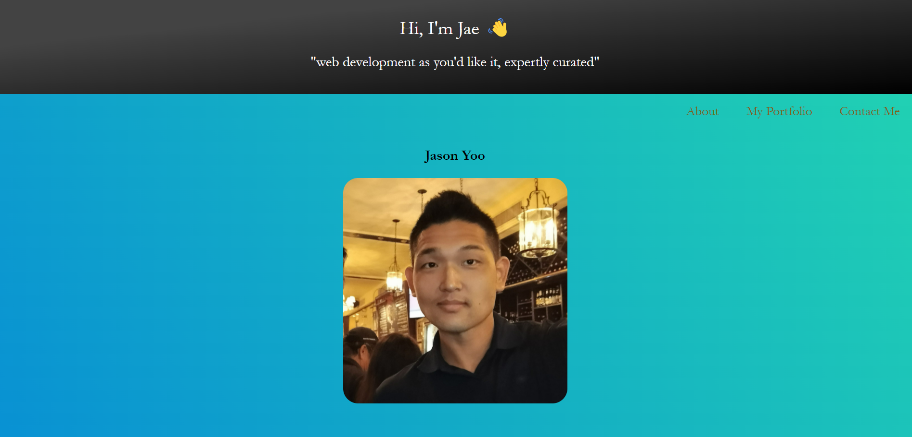
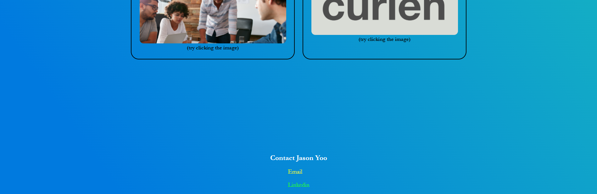

# My-Professional-Portfolio

(Homework-2: Advanced CSS: Professional Portfolio)

 

## Project Description: 

Even numbered week homework assignment. Created html and css of my professional portfolio from scratch.

  

## Table of Contents:

 

- [Installation] (#installation)
- [Usage] (#usage)
- [Credits] (#credits)
- [License] (#license)
- [Badges] (#badges)
- [Features] (#features)
- [How] (#how to contribute)
- [Criteria] (#criteria's met)
- [HTML] (#html - details)
- [CSS] (#css - details)
- [URL] (#url (github repository))
- [URL] (#url (published webpage))

 

## Installation
 
** Go to <a href="https://jasonjayoo.github.io/My-Professional-Portfolio/" target="_blank">My-Professional-Portfolio</a> In order to view My Professional Portfolio Webpage.

 
 

## Usage: screenshots + mockup - (Highlighted Title(s) = a hyperlink to the direct image)

 

[Mockup](images/Mockup.png)

 
 

[Screenshot1](images/Screenshot1.png)

[Screenshot2](images/Screenshot2.png)

[Screenshot3](images/Screenshot3.png)

 
 

## Credits:

- I would like to thank Mr. <strong>Jeoffrey Batangan</strong> for his stellar contribution to the development of the CSS on my portfolio. Thank you for taking me from "hacking" my page to implementing flexbox in order to modernize and streamline the website. I have learned much!

 
 

## License:
 
    -  Non applicable as of this time
 
 

## Badges:
 
    - UCI Full Stack Bootcamp
 
 

## Features:
 
    - Nav bar titles links to the local sections of the webpage.
    - Image of the three projects opens new tab to the websites.
    - Contact email will open up email browser for users.
    - Linkedin link will open to my linkedin profile on a new tab.
 
 

## How to Contribute:
 
    - My github repository is publically viewable. If you would to contribute to the webpage please email me at my link on the webpage with you github username and I will add you as a contributor on the repo. 
 
 

## Tests:
 
    - You can test out the webpage on vsc or directly in the inspect window of your browser. 
 
 

## Criteria's met: 

 

1. Header with my name and introduction pitch. 
2. Nav bar with local page links to; about me, my portfolio, and contact information/links.
3. About me includes: a recent photo of me, my name placed above my photo and with a sales pitch paragraph placed below the image. 
4. My portfolio of works are set in display: flex, flex-flow: column wrap.
5. The first project; Green Bay Packers Fan Page was sized larger than the other two projects via large png file size. Did not need to render any image width or height changes in css for the first project.
6. Each portfolio image acts as a link to the deployed web page.
7. media query was set for three distinct viewport aspect ratio; 825px, 565px, and 300px. These three sizes render the best responses in dev tools. Adjustments to flex grow shrink and basis along with text size and alignments were made. 

 
 

## HTML - Details:

 

1. Created base HTML template of: head, body, header, main, section, and footer.
2. Added the nav bar between the header and main elements with unordered lists with three lists that included: about me, works, and contact me. 
3. Created main id="about-me" with my name, picture and sales pitch in a paragraph tag.
4. Created section id="works" for my three portfolios of work
5. Under the section I added two div classes, "card firstproject" for the primary project and "card" for the other two projects. 
6. Added anchor reference links to the images of the projects to render the images to act as links to the deployed websites. Added (try clicking the image) to let the user know the images were also links to the actual webpages.
7. Added a span to the title of "card firstproject" to customize text color later in the css.
8. Created footer id="contact-me" added span to each anchor href tag to customize the text color to make it stand out (pop).

 
 

## CSS - Details:

 

1. Root variable was add towards the end of the work but it was placed at the top as necessary to render. 
2. Universal selector set for box sizing border box, padding 0 and margin 0.
3. Body background image set to specified linear gradient, font set to Georgia, Sans-serif.
4. Header set as a flex container with column wrap specs and centering. Background color customized with linear gradient specs.
5. Added emoji to header in HTML and added font-weight of 300 to make the colors render.
6. Adjusted padding in header h1 and h2 to give proportional spacing
7. Nav bar was made a flex container with row wrap and flex end specs. Set font to Garamond. Font size 22px with custom padding.
8. Added ul li to nav so links don't render with a bullet point
9. Nav anchors given specified values for a flex item and added flex basis of 300 and var for color. Made it flex-end to render on right side of the nav bar.
10. Main element made into a flex container with column wrap and centered.
11. Main imgs given margins for spacing between image and text, also added border radius to round out corners of the images
12. Main paragraph centered and font size of 20px specified with margins for spacing.
13. Section element made into a flex container with row wrap and centered and given a div id as "works" in html.
14. Div class "Card" and "Card firstproject" created. Card clas made into a flex container with column direction and baseline justification of content. Black border of 1px solid added with padding.
15. firstproject class was given flex basis of 300px for media query purposes later on.
16. Rounded out images in the card class with border radius.
17. Aligned h3 text in card class to render in the center above the images/links.
18. first project title was given customized Green Bay Packers colors of Green and Yellow. Yellow was rendered with var.
19. Footer element made into a flex container with column wrap specification. Padding added to give adequate spacing between project images and contact info.
20. Spaced out links under the footer with padding and gave it specified colors to make each link stand out.
21. Added media queries for screen max widths of 825px, 565px, 300px. Adjusted each with parameters for images and font size that best fit the specified screen width sizes. 
 
 
 

## URL (Github Repository):

Click [here](https://github.com/jasonjayoo/My-Professional-Portfolio) to go to My-Professional-Portfolio Github Repository

 

## URL (Published Webpage):

<a href="https://jasonjayoo.github.io/My-Professional-Portfolio/" target="_blank">My-Professional-Portfolio</a>

